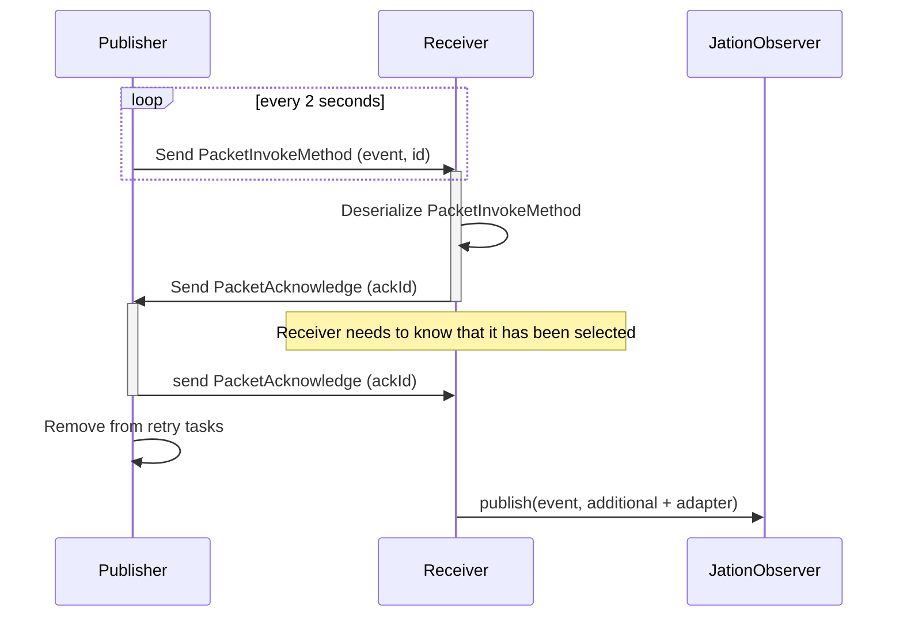
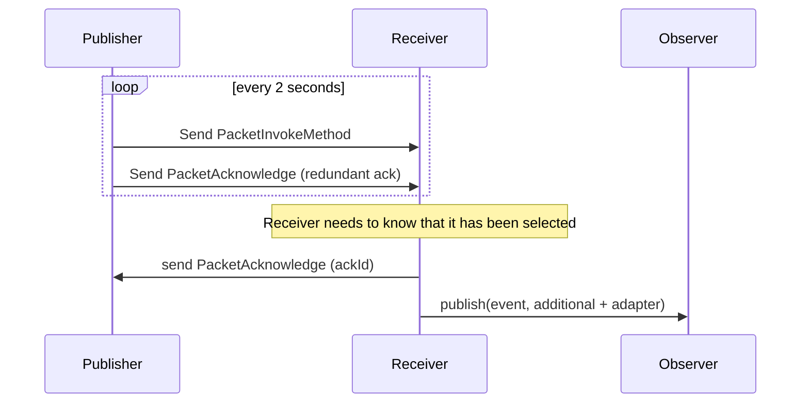

#### EXACTLY_ONCE

```mermaid
sequenceDiagram
    participant Publisher as Publisher
    participant Receiver as Receiver
    participant Observer as JationObserver

    loop every 2 seconds
        Publisher->>Receiver: Send PacketInvokeMethod (event, id)
        activate Receiver
    end

    Receiver->>Receiver: Deserialize PacketInvokeMethod
    Receiver->>Publisher: Send PacketAcknowledge (ackId)
    deactivate Receiver

    activate Publisher
    Note over Receiver: Receiver needs to know that it has been selected
    Publisher->>Receiver: send PacketAcknowledge (ackId)
    deactivate Publisher
    
    Publisher->>Publisher: Remove from retry tasks

    Receiver->>Observer: publish(event, additional + adapter)
```

#### AT_LEAST_ONCE

```mermaid
sequenceDiagram
    participant Publisher
    participant Receiver

    loop every 2 seconds
        Publisher->>Receiver: Send PacketInvokeMethod
        Publisher->>Receiver: Send PacketAcknowledge (redundant ack)
    end
    
    Note over Receiver: Receiver needs to know that it has been selected
    Receiver->>Publisher: send PacketAcknowledge (ackId)

    Receiver->>Observer: publish(event, additional + adapter)
```